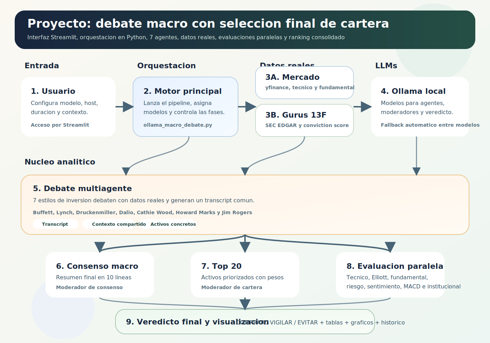
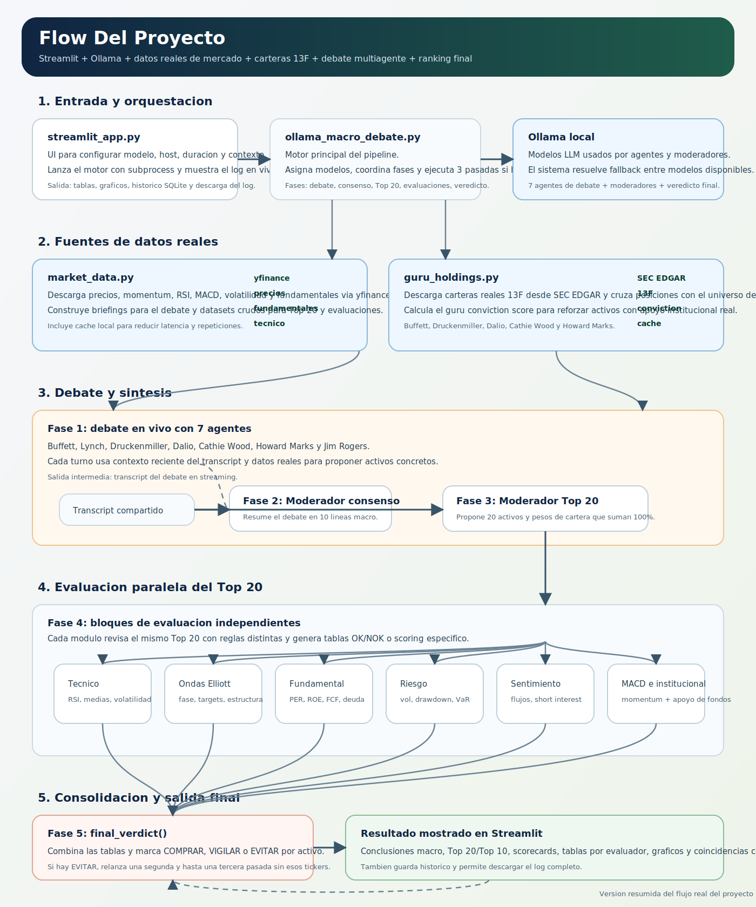

# Debate Macro con 7 Agentes (Ollama local)

Aplicacion en Python que ejecuta un debate de inversion con 7 agentes inspirados en gestores legendarios, alimentado con datos reales de mercado, carteras 13F y una capa final de evaluacion tecnica, fundamental, de riesgo, sentimiento e institucional.

Participantes del debate:

- Warren Buffett (valor y largo plazo)
- Peter Lynch (crecimiento entendible)
- Stanley Druckenmiller (macro y liquidez)
- Ray Dalio (ciclos y All Weather)
- Cathie Wood (innovacion disruptiva)
- Howard Marks (credito y ciclos)
- Jim Rogers (commodities y mercados globales)

El sistema genera:

- Debate en vivo con transcript completo
- Consenso macro sintetizado
- Top 20 de inversiones con pesos
- Evaluaciones independientes por activo
- Veredicto final con etiquetas `COMPRAR`, `VIGILAR` o `EVITAR`
- Visualizacion en Streamlit con tablas, graficos e historico

## Flujo Del Proyecto

### Vista Ejecutiva



### Vista Tecnica



Tras un tiempo objetivo, el sistema fuerza un consenso, construye el ranking de activos y ejecuta hasta tres pasadas para depurar activos descartados.

## Requisitos

- Tener Ollama instalado y corriendo en local.
- Tener descargado un modelo (ejemplo: `ollama pull llama3.1`).

## Instalacion

```bash
pip install -r requirements.txt
```

## Ejecucion

```bash
python ollama_macro_debate.py --model llama3.1 --seconds 50
```

## Ejecucion con Streamlit (recomendado para visualizar mejor)

```bash
streamlit run streamlit_app.py
```

Desde la interfaz puedes:

- Ajustar modelo, host y parametros del debate.
- Ver toda la salida en tiempo real.
- Descargar el log completo al terminar.

Opciones utiles:

- `--host http://127.0.0.1:11434`
- `--max-turns 24`
- `--context-lines 18`

## Nota

El programa imprime el debate en streaming para que lo leas mientras se escribe.
